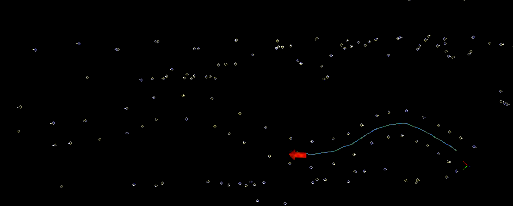

# Urinay

Urinay is a color-blind path+tracklimits algorithm developed for computing the centerline and track limits of the Formula Student driverless autocross track without the need of sensing the cones' color. It uses Delaunay triangulation and a heuristic-weighted limited-height tree search and only takes as input the cones and the car pose. Made for [BCN eMotorsport Formula Student team](https://bcnemotorsport.upc.edu) by me (Oriol Gorriz) entirely in C++ and to work with ROS.

For a **color dependant / hybrid** version check out the branch **`color`**.

## Disclaimer
If you use this algorithm for a Formula Student competition, the **only** thing I ask for is acknowledgment for the project. **ALWAYS REFERENCE** the team ***BCN eMotorsport***.

## Dependencies
- [Ubuntu](https://ubuntu.com) (tested on 20.04)
- [ROS](http://wiki.ros.org/ROS/Installation) (tested on Noetic)
- [Eigen](http://eigen.tuxfamily.org/index.php?title=Main_Page)
- *custom_msgs*: The team's proprietary communication messages package. Change it for yours. See [this issue](https://github.com/origovi/urinay/issues/1) for more info.

## 1. Delaunay Triangulation
The first step of this approach consists in obtaining the Delaunay triangulation (a set of triangles) using the detected cones as points in a 2D space.
This set is computed using my implementation of the [Bowyer-Watson algorithm](https://en.wikipedia.org/wiki/Bowyer%E2%80%93Watson_algorithm). This is an iterative process that is computed in O(*n*log*n*), being *n* the number of points. The execution time of the triangulation with a high number of cones is approximately 1ms. *Fig. 1* shows the triangle set (red) and the midpoints of every edge (green).

   
  Figure 1: Delaunay triangulation.

## 2. Triangle Filtering
Next step would be to find the midline of the track using the midpoints, but as shown in *Fig. 1*, there are so many midpoints that can lead to a misscalculation of the track's midline. To avoid this issue, we remove those triangles having large edges or tiny angles.

As shown in *Fig. 2*, we can already see a very clear path (midline) out of the green points.

   
  Figure 2: Filtered Delaunay triangulation.

## 3. Midline Calculation
Now we need to obtain a midline from the triangle edges' midpoints. This midline will be an array of midpoints in the order in which the car will reach them.

Urinay solves this problem by implementing an iterative heuristic-weighted limited-height tree search.

### 3.1. Tree search
Tree search provides a certain "intelligence" to the algorithm, of course we can iteratively append the best midpoint to the midline by just looking at the distance and angle but this will not end up with the best overall midline. We need to consider options that are not "the best" at a local sight.
As shown in *Fig. 3*, this tree search is a [BFS](https://en.wikipedia.org/wiki/Breadth-first_search) that keeps track of all possible paths at a given iteration, extends all of them by one midpoint each time while and appends new possible paths, while making sure that the height of the trees are always limited.
The search works as follows:

1. The **starting point** will be the midline's closest point to the car, or the car's position if the midline is empty.
2. This point will be the root of the tree, steps 3-8 will be performed for each point *p* of each path until a stop condition is found for every path. These are:
    - No possible next admissible midpoints are found.
    - The path satisfy loop closing conditions.
For performance reasons, the tree will be pruned at each iteration to only consider the **best longest** paths, we do this by removing all subpaths that are not the longest in the search buffer.
3. All midpoints within a **radius** of the point will be considered.
4. A filtering will be carried out, the following midpoints will be removed:
    - Any midpoint creating an **angle** too big with last point (avoid points behind and closed curves).
    - Any midpoint being in the same side of last edge, make sure the path **crosses** every midpoint edge (avoid bouncing on track limits).
    - Any midpoint **already contained** in the path (avoid creating incorrect loops).
    - Any midpoint whose edge's track width is too small.
    - Any midpoint that when appended to the path creates an intersection (on the path itself).
5. A **heuristic** value for each of the candidate midpoints will be calculated.
6. **Discard** all midpoints whose heuristic exceeds a threshold.
7. Append all remaining points as sons of *p*. Effectively extending existing subpaths and creating new ones.
8. When the maximum tree search height is reached, the first midpoint of the best subpath so far will be considered as definitive.
9. We append to the definitive path the **best longest path** of the current search tree.

   
  Figure 3: Tree search visualized.

### 3.2. Fail-safe
Fail-safe(s) allow Urinay to continue the path when certain circumstances cannot be met. When track layout not being perfect/adequate, the angle or distance from a certain midpoint to another is too big, so the search will stop there (effect of midpoint filtering). To solve this issue, Urinay implements a "general" fail-safe mechanism, i.e. when the car gets too close to the end of the path (aka midline), until the normal sight horizon gets recovered, higher values of these parameters (max angle, distance, etc) are set. During this extraordinary functioning, the sight horizon will be artificially limited (keep in mind that the objective is to get out of this "misbuilt" zone). Results can be seen in *Fig. 5*.

### 3.3. Loop closure
Obviously we want to detect and compute the whole track midline. Urinay does so by checking if the loop is closed every time a new midpoint is added to the midline. There are two problems here:
1. How we detect a loop closure? If the following conditions are met:
    - The midline has a **length** greater than a threshold.
    - The first and last points of the midline are **closer** than a threshold.
    - The angle created by the first and last midpoint is acceptable (bigger than a threshold).
2. The tree search will never take points already contained in the midline. To make the loop closure detection more robust, we allow the search to take *k* midpoints after a candidate for loop closure has been found, continuing the tree search even after finding a candidate for loop closure.

## 4. Track limits computation
When guiding the car through the obtained midline, the trajectory planner (an algorithm that computes the exact trajectory the car has to follow, using the midline) will also need the track limits so the algorithm can take into account how much the car can deviate from the midline without crashing into the track limits.

To calculate the track limits having the midline is a relatively easy task knowing that every point in the midline has its correspondant edge in the triangle set. The two points that create this edge will be part of the track limits.

If we iterate the midline and we find which side of the track every point of the midpoint's edge belongs to, an aggregation of these points create the track limits.

## 5. Midline accumulation
We need to accumulate the midline so when the car moves we still know which was the midline the car has already driven through and to close the loop when we have already seen the whole track. There is another problem, we cannot compute again and again the midline from the beginning of the track because it would take longer to compute and it may fail if we lose the cones of the beginning (or a lot of false positives are detected).

This is why program has also the car's position in the track. Knowing where the car is at every moment gives the possibility to compute the midline from the car's position and then merge it with last iteration's midline, as seen in *Fig. 3*. This way, when a circular midline is detected, the program can communicate it to the path planning (and loop path optimizer) and stop.

## 6. Result
The result can be seen in *Fig. 4*. Urinay always chooses the best-longest way, this is why it sometimes wants to take an incorrect path but amends it once the correct path is perceived.

   
  Figure 4: Urinay's path+tracklimits

In *Fig. 5*, you can see at the left-most point of the path, there is a very tight turn. You can see that the path does not continue until the car gets close the end of it. Then, the fail-safe gets triggered and momentarily the path continues for only a limited length. When the car gets passed this situation, normal parameters and "long" path get restored.

   
  Figure 5: Urinay's fail-safe situation.

## 7. Considerations
The following considerations have been taken into account when design and implementation of Urinay:
1. Cone position gets more accurate when car comes close to cones: It is assumed that **the closer a cone is, the more accurate its location should be**. The algorithm is constantly updating the cones' position.
2. Path sections that the car has driven through is assumed to be correct: Cones belonging to a sector the car already went through may also move (due to perception). In this case, since the car has already been there, it is no further re-calculated and kept as static. It is assumed here that SLAM is robust enough to not change cone positions after car has been really close to them, if this is not your case, this behaviour should be adapted.
3. Car may go off-track (or run over cones): Due to control or mechanical issues, the car may deviate from the calculated path. It is very important that the **path does not depend on the car's position** (we want the car to go back to the track). To do so (and also achieving consideration 2.), the **path is always recalculated FROM the last midline's midpoint closest to the car**. But when the car is standing still, all path is recomputed from scratch.
4. No abusive use of pointers: In the program there are some places where data is duplicated with the intention to maintain modularity, make a procedure easier to undersand or to avoid a possible invalid pointer.
5. Finally, Urinay tries to make sure that if the car perceives two (or more) plausible paths to take (e.g. when there is a wall nearby, the wall is an array of cones and a lane is created between a real cone track limit and the wall). It will take the correct path if the correct path is perceived with enough range.